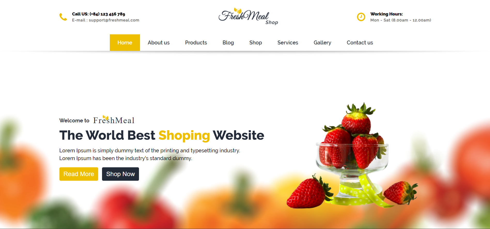
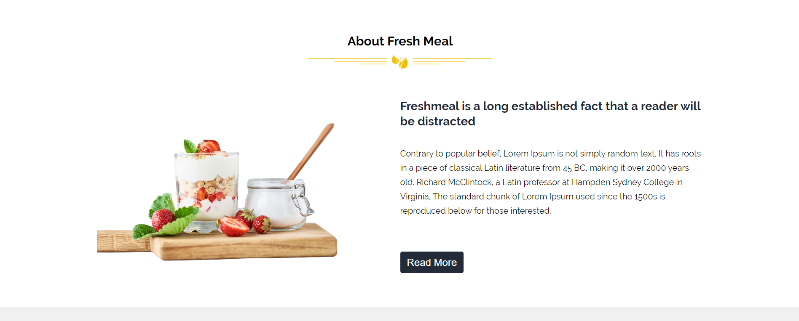
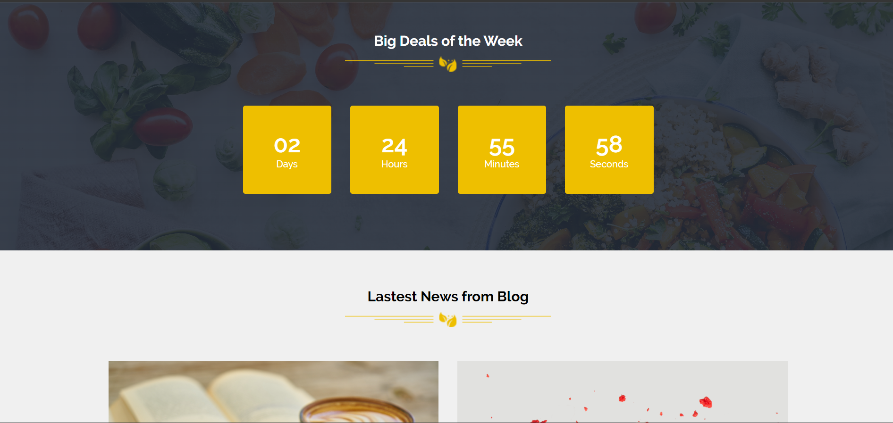
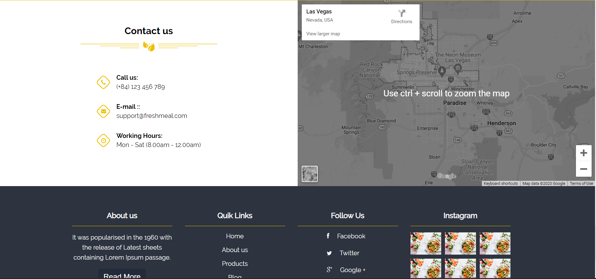

# Restaurant Website

The restaurant webpage designed using HTML, CSS, and JavaScript is a visually appealing and interactive platform that provides visitors with a seamless user experience. It features a well-organized layout, mouth-watering images, easy-to-navigate menus, and a reservation system. The website's responsive design makes it accessible on various devices, making it a great tool for promoting the restaurant's cuisine and services.

# Link

[Click here](https://tinyurl.com/freshMeal) To see live demo.
# Languages Used 

    1. HTML5
    2. CSS3
    3. Javascript
    
# Images

